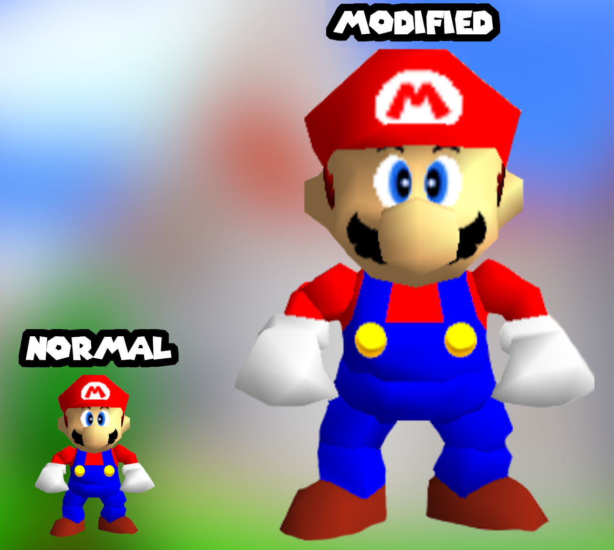
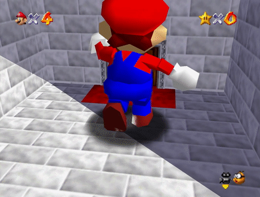
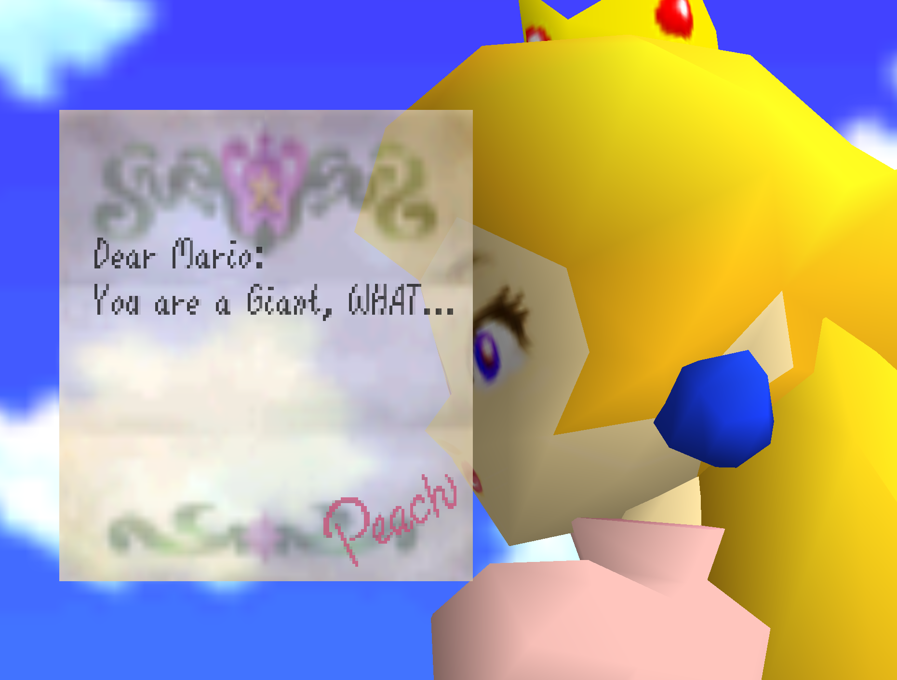

# Super-Mario-64-but-he-is-very-big
 [How To Setup](#how-to-setup)
  - [Download Patch File](#download-patch-file)
  - [Instruction](#instruction)
- [Explanation of the Mod](#explanation-of-the-mod)
  - [Why do I still documentate it](#why-do-i-still-documentate-it)
- [Creation Process of the Mod](#creation-process-of-the-mod)
  - [Preperations](#preperations)
  - [Editing of the Code](#editing-of-the-code)
- [My Shorts Video of the Mod](#My-shorts-video-of-the-mod)

<br>

# How To Setup # 
This is how you set up this Mod.

## Download Patch File ##
Download the Patch File of the Mod: <br>
... Link coming soon ...

## Instruction ##
Check out this Repository to see how you can setup most Super Mario 64 Mods: <br>
https://github.com/StarlyTTV/How-to-Setup-a-Super-Mario-64-Mod

<br>

# Explanation of the Mod
This Mod was just created as a joke. The function to open doors has been removed, because Mario is too big to open them. This Mod was only created for a Joke Shorts Video.

## Why do I still documentate it ##
Even if it was just a Joke Mod I wanna remember in the future how I did it and maybe it interests someone else and inspires them to create their own Mod.

# Creation Process of the Mod #
I will explain how I created the Mod.

## Preperations ##
To edit the Source Code of Super Mario 64, I got the UltraSM64 repository set up. 

The UltraSM64 Repository is a Fork of the SM64 decompilation project that adds several quality-of-life patches: <br>
https://github.com/CrashOveride95/ultrasm64

A fork is a new repository that shares code with the original repository, where you can make changes without affecting the original repository.

--> The Super Mario 64 Decompilation Project is an absolutely impressive project by Fans that reverse engineered and decompiled the entire source Code of Super Mario 64. Saying it more simplified, they analyzed the machine code and recreated the code in a higher-level programming language.

## Preperations ##
To edit the Source Code of Super Mario 64, I got the UltraSM64 repository set up. 

The UltraSM64 Repository is a Fork of the SM64 decompilation project that adds several quality-of-life patches: <br>
https://github.com/CrashOveride95/ultrasm64

A fork is a new repository that shares code with the original repository, where you can make changes without affecting the original repository.

--> The Super Mario 64 Decompilation Project is an absolutely impressive project by Fans that reverse engineered and decompiled the entire source Code of Super Mario 64. Saying it more simplified, they analyzed the machine code and recreated the code in a higher-level programming language.

### How to setup the repository ###
To setup the repository I followed this tutorial, but instead of cloning the HackerSM64 repository, I cloned the UltraSM64 repository: <br>
https://github.com/HackerN64/HackerSM64/wiki/Installing-HackerSM64

## Editing of the Code ##
After setting up the repository, I edited the Mario 64 Code with Visual Studio Code: <br>
https://code.visualstudio.com/

### File Listing ###
These are all the Files, that I changed:

* src\game\object_list_processor.c
* data\behaviour_data.c
* text\us\dialogs.h

## What I changed ###
Here are the changes listed, that I made to the files.

____________________________________
#### src\game\object_list_processor.c --> Is used to process objects within the game.

To change Marios size permanently (Increasing him by 300%) I added the following Code to the Function **"bhv_mario_update"**: <br>
```C
// Apply scaling here
  f32 scale = 4; // Set the desired scaling factor (e.g., 300%)
    
  // Apply scaling to the Mario object's scale vector
  gCurrentObject->header.gfx.scale[0] = scale;
  gCurrentObject->header.gfx.scale[1] = scale;
  gCurrentObject->header.gfx.scale[2] = scale;
```



____________________________________
#### data\behaviour_data.c --> Handles behaviour of objects, characters, enemies and other elements in the game

I changed a bunch of speed stats. I just searched for speed, looked what the respective speed stat is for (walking speed, shell speed, etc ...) and changed it, until it felt right.

I commented out the line in the function **"bhv_mario_update"**, which handles interaction with doors, so you can't go into doors anymore:
```C
const BehaviorScript bhvDoorWarp[] = {
    BEGIN(OBJ_LIST_SURFACE),
    // SET_INT(oInteractType, INTERACT_WARP_DOOR),
    GOTO(bhvDoor + 1 + 1),
};
```
 <br>

____________________________________
#### text\us\dialogs.h --> Contains written dialog of the game

I changed the written dialog in the beginning cutscene of the game (Dialog 20):
```h
DEFINE_DIALOG(DIALOG_020, 1, 6, 95, 150, _("\
Dear Mario:\n\
You are a Giant, WHAT..."))
```


### Testing ###
If changes need to be tested, the following command can be used in the Ubuntu command line to create a rom (you need to change to the right directory first):
```
make -j$(nproc)
```

After that, a folder named "build" will be created with the created ROM inside it.

To test the game, I would recommend the following Emulator (It's the most practical one to test in my opinion): <br>
https://parallel-launcher.ca/

# My Shorts Video of the Mod #
YouTube Clips Channel: <br>https://www.youtube.com/shorts/PtrpOmF9Vn4 <br> <br>
TikTok: <br>https://www.tiktok.com/@starlyttv/video/7291429492147359008
